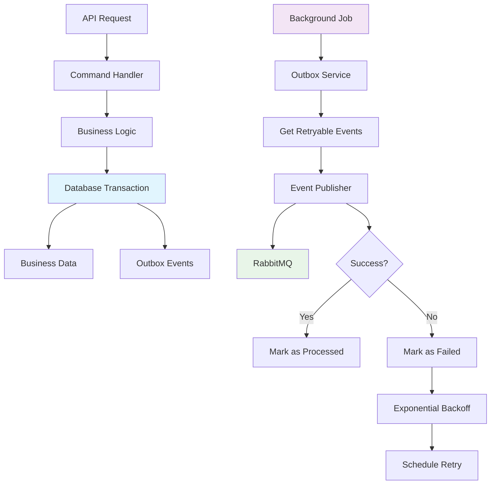
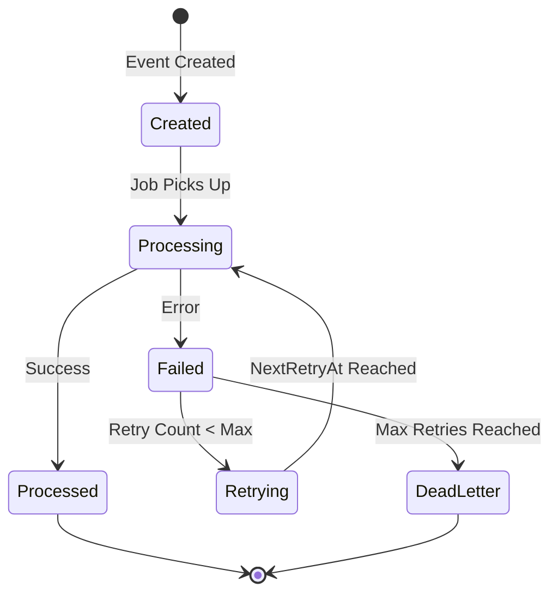

# Transactional Outbox Pattern Implementation Guide

## Table of Contents
1. [Overview](#overview)
2. [Architecture](#architecture)
3. [Core Components](#core-components)
4. [Implementation Details](#implementation-details)
5. [Retry Mechanism](#retry-mechanism)
6. [Configuration](#configuration)
7. [Testing](#testing)
8. [Monitoring](#monitoring)
9. [Production Considerations](#production-considerations)

## Overview

The Transactional Outbox Pattern is implemented in our Smart Event and Ticket Management Platform to ensure **reliable message delivery** and **eventual consistency** across microservices. This pattern guarantees that business operations and event publishing happen atomically, preventing data inconsistencies in distributed systems.

### Key Benefits
- ✅ **Exactly-once delivery** - No lost or duplicate events
- ✅ **ACID compliance** - Events stored in same transaction as business data
- ✅ **Fault tolerance** - Automatic retry with exponential backoff
- ✅ **Observability** - Complete audit trail and monitoring
- ✅ **Eventual consistency** - All services eventually receive events

## Architecture



## Core Components

### 1. OutboxEvent Entity

**Location:** `Ticketing.Domain/Entities/OutboxEvent.cs`

```csharp
public class OutboxEvent
{
    [Key]
    public Guid Id { get; set; }                    // Unique identifier
    public string EventType { get; set; }           // Event type (e.g., "ReservationCreated")
    public string EventData { get; set; }           // JSON serialized event payload
    public DateTime CreatedAt { get; set; }         // When event was created
    public DateTime? ProcessedAt { get; set; }      // When successfully processed
    public bool IsProcessed { get; set; }           // Processing status flag
    
    // Retry Mechanism Fields
    public int RetryCount { get; set; } = 0;        // Current retry attempt
    public int MaxRetries { get; set; } = 3;        // Maximum retry attempts
    public DateTime? NextRetryAt { get; set; }      // When to retry next
    public string LastError { get; set; }           // Last error message
}
```

**Key Design Decisions:**
- **Guid ID**: Ensures uniqueness across distributed systems
- **JSON EventData**: Flexible payload storage for any event type
- **Retry Fields**: Built-in exponential backoff mechanism
- **Timestamps**: Complete audit trail for debugging

### 2. IOutboxService Interface

**Location:** `Ticketing.Application/interface/IOutboxService.cs`

```csharp
public interface IOutboxService
{
    Task SaveEventAsync(string eventType, object eventData);
    Task<IEnumerable<OutboxEvent>> GetUnprocessedEventsAsync();
    Task<IEnumerable<OutboxEvent>> GetRetryableEventsAsync();
    Task MarkAsProcessedAsync(Guid eventId);
    Task MarkAsFailedAsync(Guid eventId, string error);
}
```

## Implementation Details

### 1. OutboxService Implementation

**Location:** `Ticketing.Infrastructure/Services/OutboxService.cs`

#### Core Methods Analysis

**a) SaveEventAsync - Transactional Event Storage**
```csharp
public async Task SaveEventAsync(string eventType, object eventData)
{
    var outboxEvent = new OutboxEvent
    {
        Id = Guid.NewGuid(),
        EventType = eventType,
        EventData = JsonSerializer.Serialize(eventData),
        CreatedAt = DateTime.UtcNow,
        IsProcessed = false
    };

    await _context.OutboxEvents.AddAsync(outboxEvent);
    // ⚠️ CRITICAL: No SaveChanges() here - handled by command handler
}
```

**Why no SaveChanges()?**
- The command handler manages the transaction
- Ensures business data and events are committed together
- Maintains ACID properties across the entire operation

**b) GetRetryableEventsAsync - Smart Event Selection**
```csharp
public async Task<IEnumerable<OutboxEvent>> GetRetryableEventsAsync()
{
    return await _context.OutboxEvents
        .Where(e => !e.IsProcessed &&                           // Not yet processed
                   e.RetryCount < e.MaxRetries &&               // Under retry limit
                   (e.NextRetryAt == null ||                     // First attempt OR
                    e.NextRetryAt <= DateTime.UtcNow))          // Retry time reached
        .OrderBy(e => e.CreatedAt)                              // FIFO processing
        .ToListAsync();
}
```

**Query Logic Breakdown:**
1. **!e.IsProcessed**: Only unprocessed events
2. **e.RetryCount < e.MaxRetries**: Prevents infinite retries
3. **NextRetryAt check**: Respects exponential backoff timing
4. **OrderBy CreatedAt**: Ensures FIFO processing order

**c) MarkAsFailedAsync - Exponential Backoff Implementation**
```csharp
public async Task MarkAsFailedAsync(Guid eventId, string error)
{
    var outboxEvent = await _context.OutboxEvents.FindAsync(eventId);
    if (outboxEvent != null)
    {
        outboxEvent.RetryCount++;
        outboxEvent.LastError = error;
        // 🔥 Exponential backoff: 2^retryCount minutes
        outboxEvent.NextRetryAt = DateTime.UtcNow.AddMinutes(Math.Pow(2, outboxEvent.RetryCount));
        await _context.SaveChangesAsync();
    }
}
```

### 2. Command Handler Integration

**Location:** `Ticketing.Application/Commands/ReservationCommandHandlers.cs`

#### Transactional Event Creation Example

```csharp
public async Task<ReservationDto> CreateAsync(ReservationDto dto)
{
    // 1️⃣ Execute Business Logic
    var reservation = new Reservation(dto.UserId, dto.EventId, dto.ExpiresAt);

    // 2️⃣ Save Business Data (in transaction)
    await _repository.AddAsync(reservation);
    
    // 3️⃣ Save Event (in same transaction)
    await _outboxService.SaveEventAsync("ReservationCreated", new { 
        ReservationId = reservation.Id, 
        UserId = reservation.UserId,
        EventId = reservation.EventId 
    });

    // 4️⃣ Commit Transaction (ACID guarantee)
    await _repository.SaveChangesAsync();

    return MapToDto(reservation);
}
```

**Critical Points:**
- **Single Transaction**: Business data and outbox event committed together
- **ACID Compliance**: Either both succeed or both fail
- **No Direct Publishing**: Events stored first, published asynchronously

### 3. Background Publisher Job

**Location:** `Ticketing.Infrastructure/Jobs/OutboxPublisherJob.cs`

```csharp
public class OutboxPublisherJob : IJob
{
    public async Task Execute(IJobExecutionContext context)
    {
        _logger.LogInformation("Starting outbox publisher job");
        
        var retryableEvents = await _outboxService.GetRetryableEventsAsync();
        var processedCount = 0;
        var failedCount = 0;

        foreach (var outboxEvent in retryableEvents)
        {
            try
            {
                // 🚀 Attempt to publish event
                await _eventPublisher.PublishAsync(outboxEvent.EventType, outboxEvent.EventData);
                await _outboxService.MarkAsProcessedAsync(outboxEvent.Id);
                processedCount++;
                
                _logger.LogInformation($"✅ Published event {outboxEvent.Id} of type {outboxEvent.EventType}");
            }
            catch (Exception ex)
            {
                failedCount++;
                _logger.LogError(ex, $"❌ Failed event {outboxEvent.Id} (attempt {outboxEvent.RetryCount + 1})");
                await _outboxService.MarkAsFailedAsync(outboxEvent.Id, ex.Message);
            }
        }
        
        _logger.LogInformation($"Job completed. Processed: {processedCount}, Failed: {failedCount}");
    }
}
```

**Job Characteristics:**
- **Idempotent**: Safe to run multiple times
- **Fault Tolerant**: Individual event failures don't stop processing
- **Observable**: Comprehensive logging for monitoring

## Retry Mechanism

### 1. Exponential Backoff Strategy

Our implementation uses exponential backoff to handle temporary failures gracefully:

```
Retry Attempt | Delay Formula | Actual Delay | Cumulative Wait
-------------|---------------|--------------|----------------
1            | 2^1 minutes   | 2 minutes    | 2 minutes
2            | 2^2 minutes   | 4 minutes    | 6 minutes
3            | 2^3 minutes   | 8 minutes    | 14 minutes
Max Reached  | Dead Letter   | ∞            | Manual Intervention
```

### 2. Retry State Machine



### 3. Error Scenarios and Handling

| Error Type | Example | Retry Strategy | Expected Outcome |
|------------|---------|----------------|------------------|
| **Network Timeout** | RabbitMQ unreachable | Exponential backoff | Eventually succeeds when network recovers |
| **Service Unavailable** | RabbitMQ down | Exponential backoff | Succeeds when service restarts |
| **Serialization Error** | Invalid JSON | No retry (permanent) | Dead letter - requires manual fix |
| **Authentication Error** | Invalid credentials | No retry (permanent) | Dead letter - requires configuration fix |
| **Rate Limiting** | Too many requests | Exponential backoff | Succeeds when rate limit resets |

### 4. Retry Query Logic Deep Dive

```csharp
// The WHERE clause breakdown:
.Where(e => 
    !e.IsProcessed &&                    // ✅ Not successfully processed
    e.RetryCount < e.MaxRetries &&       // ✅ Still has retry attempts left
    (e.NextRetryAt == null ||            // ✅ First attempt (no retry time set)
     e.NextRetryAt <= DateTime.UtcNow)   // ✅ OR retry time has arrived
)
```

**Example Event Lifecycle:**
```
Event Created:     IsProcessed=false, RetryCount=0, NextRetryAt=null
First Failure:     IsProcessed=false, RetryCount=1, NextRetryAt=Now+2min
Second Failure:    IsProcessed=false, RetryCount=2, NextRetryAt=Now+4min
Third Failure:     IsProcessed=false, RetryCount=3, NextRetryAt=Now+8min
Max Retries:       IsProcessed=false, RetryCount=3, NextRetryAt=Now+8min (Dead Letter)
Success:           IsProcessed=true,  ProcessedAt=Now
```

## Configuration

### 1. Quartz.NET Job Scheduling

**Location:** `SmartPlatform.Api/Program.cs`

```csharp
builder.Services.AddQuartz(q =>
{
    q.UseMicrosoftDependencyInjection();
    
    var jobKey = new JobKey("OutboxPublisherJob");
    q.AddJob<OutboxPublisherJob>(opts => opts.WithIdentity(jobKey));
    
    q.AddTrigger(opts => opts
        .ForJob(jobKey)
        .WithIdentity("OutboxPublisherJob-trigger")
        .WithSimpleSchedule(x => x
            .WithIntervalInSeconds(30)    // 🔄 Run every 30 seconds
            .RepeatForever()));
});

builder.Services.AddQuartzHostedService(q => q.WaitForJobsToComplete = true);
```

**Configuration Options:**
- **Interval**: 30 seconds (configurable based on requirements)
- **Concurrency**: DisallowConcurrentExecution prevents overlapping runs
- **Graceful Shutdown**: WaitForJobsToComplete ensures clean shutdown

### 2. Database Configuration

The outbox table is automatically created through Entity Framework migrations:

```sql
CREATE TABLE "OutboxEvents" (
    "Id" uuid NOT NULL,
    "EventType" text NOT NULL,
    "EventData" text NOT NULL,
    "CreatedAt" timestamp with time zone NOT NULL,
    "ProcessedAt" timestamp with time zone,
    "IsProcessed" boolean NOT NULL,
    "RetryCount" integer NOT NULL DEFAULT 0,
    "MaxRetries" integer NOT NULL DEFAULT 3,
    "NextRetryAt" timestamp with time zone,
    "LastError" text,
    CONSTRAINT "PK_OutboxEvents" PRIMARY KEY ("Id")
);

-- Performance indexes
CREATE INDEX "IX_OutboxEvents_IsProcessed_RetryCount" ON "OutboxEvents" ("IsProcessed", "RetryCount");
CREATE INDEX "IX_OutboxEvents_NextRetryAt" ON "OutboxEvents" ("NextRetryAt");
CREATE INDEX "IX_OutboxEvents_CreatedAt" ON "OutboxEvents" ("CreatedAt");
```

## Testing

### 1. Manual Testing

**Test Event Creation:**
```bash
# Create a test event
curl -X POST http://localhost:5000/test/outbox \
  -H "Content-Type: application/json"

# Response: "Test event added to outbox"
```

**Monitor Database:**
```sql
-- Check outbox events
SELECT 
    "Id",
    "EventType",
    "IsProcessed",
    "RetryCount",
    "NextRetryAt",
    "LastError",
    "CreatedAt"
FROM "OutboxEvents" 
ORDER BY "CreatedAt" DESC;
```

**Monitor Logs:**
```bash
# Watch job execution
docker-compose logs -f backend-api | grep "outbox"

# Expected output:
# ✅ Published event 123e4567-e89b-12d3-a456-426614174000 of type TestEvent
# ❌ Failed event 123e4567-e89b-12d3-a456-426614174001 (attempt 1)
```

### 2. Failure Simulation

The RabbitMQEventPublisher includes built-in failure simulation:

```csharp
// Simulate 10% failure rate for testing
if (new Random().Next(1, 10) == 1)
{
    throw new Exception("Simulated publishing failure");
}
```

**Test Retry Behavior:**
1. Create multiple test events
2. Observe some events fail initially
3. Watch retry attempts with exponential backoff
4. Verify eventual success or dead letter status

### 3. Load Testing

```bash
# Generate multiple events
for i in {1..20}; do
  curl -X POST http://localhost:5000/test/outbox &
done
wait

# Monitor processing
watch -n 1 'psql -h localhost -U postgres -d SmartEventPlatformDb -c "SELECT \"IsProcessed\", COUNT(*) FROM \"OutboxEvents\" GROUP BY \"IsProcessed\";"'
```

## Monitoring

### 1. Key Metrics to Track

**Event Processing Metrics:**
- Events processed per minute
- Average processing time
- Success/failure rates
- Retry attempt distribution

**Database Metrics:**
- Outbox table size
- Unprocessed event count
- Dead letter event count
- Average event age

**System Health:**
- Job execution frequency
- Memory usage
- Database connection pool

### 2. Logging Strategy

**Structured Logging Example:**
```csharp
_logger.LogInformation("Outbox job execution", new {
    ProcessedCount = processedCount,
    FailedCount = failedCount,
    ExecutionTime = stopwatch.ElapsedMilliseconds,
    UnprocessedEvents = unprocessedCount
});
```

**Log Levels:**
- **Information**: Successful processing, job start/end
- **Warning**: Retry attempts, approaching max retries
- **Error**: Processing failures, dead letter events
- **Debug**: Detailed event data (development only)

### 3. Alerting Recommendations

**Critical Alerts:**
- Dead letter queue size > threshold
- Job execution failures
- Database connection issues
- High retry rates (> 50%)

**Warning Alerts:**
- Processing delays > 5 minutes
- Unprocessed event backlog
- Memory usage spikes

## Production Considerations

### 1. Performance Optimization

**Database Optimization:**
```sql
-- Essential indexes for performance
CREATE INDEX CONCURRENTLY "IX_OutboxEvents_Processing" 
ON "OutboxEvents" ("IsProcessed", "RetryCount", "NextRetryAt") 
WHERE "IsProcessed" = false;

-- Partial index for active events only
CREATE INDEX CONCURRENTLY "IX_OutboxEvents_Active" 
ON "OutboxEvents" ("CreatedAt") 
WHERE "IsProcessed" = false;
```

**Batch Processing:**
```csharp
// Process events in batches for better performance
var batchSize = 100;
var events = await _outboxService.GetRetryableEventsAsync();
var batches = events.Chunk(batchSize);

foreach (var batch in batches)
{
    await ProcessBatchAsync(batch);
}
```

### 2. Scaling Considerations

**Horizontal Scaling:**
- Multiple publisher job instances with coordination
- Database connection pooling
- Event partitioning strategies

**Vertical Scaling:**
- Increased job frequency for high-throughput scenarios
- Larger batch sizes for bulk processing
- Memory optimization for large event payloads

### 3. Data Retention Strategy

**Cleanup Strategy:**
```csharp
// Archive processed events older than 30 days
public async Task ArchiveProcessedEventsAsync()
{
    var cutoffDate = DateTime.UtcNow.AddDays(-30);
    var processedEvents = await _context.OutboxEvents
        .Where(e => e.IsProcessed && e.ProcessedAt < cutoffDate)
        .ToListAsync();
    
    // Move to archive table or delete
    _context.OutboxEvents.RemoveRange(processedEvents);
    await _context.SaveChangesAsync();
}
```

### 4. Security Considerations

**Event Data Protection:**
- Encrypt sensitive data in EventData field
- Implement access controls for outbox table
- Audit trail for event processing

**Network Security:**
- TLS encryption for RabbitMQ connections
- Authentication and authorization
- Network segmentation

## Conclusion

This Transactional Outbox implementation provides a robust, production-ready solution for reliable event publishing in distributed systems. The combination of ACID transactions, exponential backoff retry logic, and comprehensive monitoring ensures high reliability and observability.

**Key Success Factors:**
1. **Atomic Operations**: Business data and events committed together
2. **Resilient Retry Logic**: Exponential backoff handles temporary failures
3. **Comprehensive Monitoring**: Full visibility into event processing
4. **Production Ready**: Performance optimizations and scaling considerations

The implementation successfully addresses the challenges of distributed system communication while maintaining data consistency and system reliability.